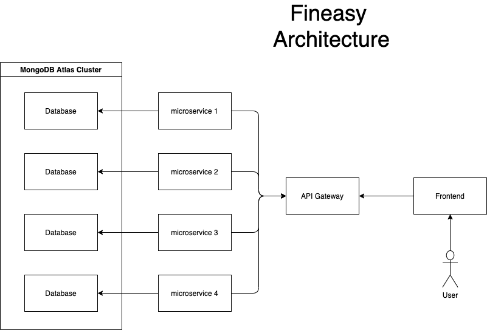

# Fineasy

Facilitando o controle de gastos

---

# Objetivo

O Fineasy tem como objetivo auxiliar as pessoas a controlar a saúde financeira. 

Atuamos em 3 pilares:

- Garantir uma melhor saúde financeira para os usuários;
- Controlar o fluxo de entrada e saída de dinheiro;
- Facilitar a visualização de dados financeiros do usuário;

---

# Arquitetura

A arquitetura que decidimos gira em torno de transformar o aplicativo o mais escalável possível, possibilitando uma melhor experiência para os usuários.

Com isso pensamos nos seguintes componentes:

- Front-end: Flutter 
- Back-end: FastAPI e Kong
- Database: MongoDB

---

# Arquitetura 

--- 

# Frontend

Atualmente já desenvolvemos as telas de:

- Login;
- Esqueceu a senha;
- Cadastro; 
- Home Page;

--- 

# Backend

Atualmente já desenvolvemos:

- CI/CD com GitHub Actions;
- Deploy no Heroku; 
- Comunicação com o banco de dados;
- Construção de um healthcheck;
- Login;

Em desenvolvimento: 

- Cadastro;

--- 

# Repositórios 

- Organização: https://github.com/fineasyio
 
    - Frontend: https://github.com/fineasyio/fineasy_backend
    - Backend: https://github.com/fineasyio/fineasy_frontend
    - Docs: https://github.com/fineasyio/fineasy_docs

--- 

